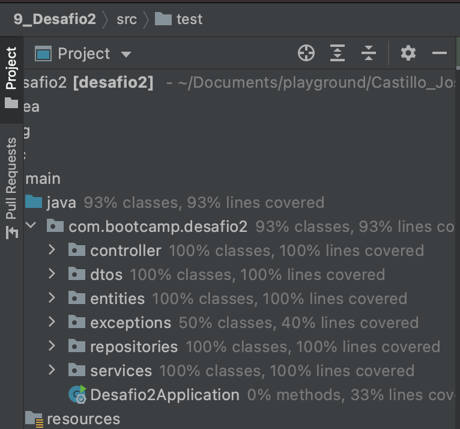
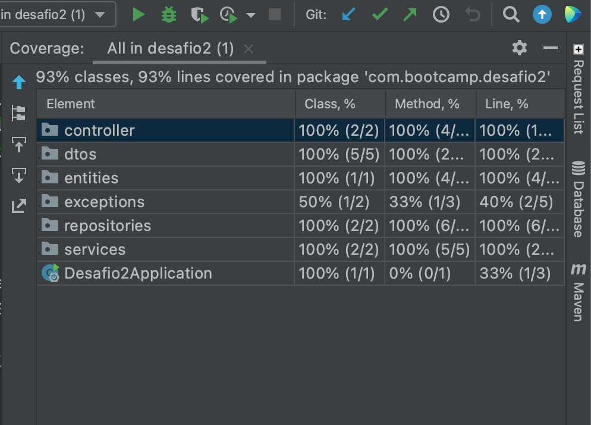

# Desafio Testing Spring
## _Autor: Jose Ricardo Castillo Bastidas_


[](https://travis-ci.org/joemccann/dillinger)

En el presente documento se presenta la información basica del desafio de testing y el detalle del servicio usado para probar en postman.


## Tabla de contenido
* [Objetivo](#objetivo)
* [Tests Implementados](#tests-implementados)
* [Servicio (endpoint)](#servicio-endpoint)
* [Evidencias](#evidencia-de-los-test-with-coverage)

## Objetivo

El objetivo de este desafío es aplicar los contenidos abordados hasta el momento durante el
BOOTCAMP MeLi (Git, Java, Spring y Testing), haciendo principal hincapié en las validaciones
y tipos de testing que pueden ser utilizados a partir de un enunciado propuesto, una
especificación de requisitos y documentación anexada.

## Tests implementados

Se implementan tests para asegurar el funcionamiento correcto de las siguientes historias de usuario:

US-0001: Calcular el total de metros cuadrados de una propiedad ***Verificar que el total de metros cuadrados totales
calculados por propiedad sea el correcto.***

US-0002: Indicar el valor de una propiedad a partir de sus ambientes y medidas.
Tener en cuenta que los precios por metro cuadrado están determinados según el barrio.
***Verificar que el barrio de entrada exista en el repositorio de barrios.***

US-0003: Determinar cuál es el ambiente más grande. ***Verificar que efectivamente se devuelva el
ambiente con mayor tamaño.***

US-0004: Determinar la cantidad de metros cuadrados que tiene cada ambiente de
una propiedad. ***Verificar que efectivamente el total de metros cuadrados por ambiente sea el correcto.***

## Servicio (endpoint)

El servicio usado para la aplicacion es de tipo POST que requiere un payload para realizar el calculo del precio de la propiedad.

Es necesario aclarar que el nombre y el precio del district (distrito) requiere existir en la base de datos estatica (prices.json) ublicada 
en el path ***/resources/static/prices.json***, en caso de no existir o coindicir, retornará un mensaje de error.

A continuación se presenta un ejemplo donde se indica el metodo a usar, el objeto requerido y la respuesta generada.

**METHOD**
POST: property/calculate

**REQUEST:**
```sh
{
    "prop_name": "Campo",
    "district": {
        "district_name": "Belgrano",
        "district_price": 1100
    },
    "environments": [
        {
            "environment_name": "Principal",
            "environment_width": 15,
            "environment_length": 20
        },
        {
            "environment_name": "Secundaria",
            "environment_width": 18.5,
            "environment_length": 23
        },
        {
            "environment_name": "Tercera",
            "environment_width": 12,
            "environment_length": 22.5
        }
    ]

}
```

**RESPONSE:**
```sh
{{
    "totalArea": 995.5,
    "propertyPrice": 1095050.0,
    "biggerEnvironment": "Secundaria",
    "environments": [
        {
            "environment_name": "Principal",
            "environment_width": 15.0,
            "environment_length": 20.0,
            "squareMeters": 300.0
        },
        {
            "environment_name": "Secundaria",
            "environment_width": 18.5,
            "environment_length": 23.0,
            "squareMeters": 425.5
        },
        {
            "environment_name": "Tercera",
            "environment_width": 12.0,
            "environment_length": 22.5,
            "squareMeters": 270.0
        }
    ]
}
```

## Evidencia de los test with coverage


