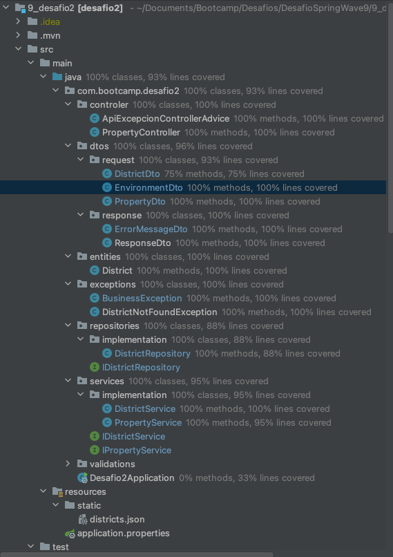

# Desafio Spring
## _Autor: Jhonnatan Felipe Sanchez Cortes_


[](https://travis-ci.org/joemccann/dillinger)

En el presente documento se presenta la información basica del desafio de testing y el detalle del servicio usado para probar en postman.


## Contenido

- Presentación general del proyecto
- Documentación del servicio
- Evidencia del coverage

## Presentación

El proyecto presente en el repositorio AlanCanoDigitalHouse/DesafioSpringWave9 presenta en el branch Sanchez_Jhonnatan la carpeta 9_desafio2.

En dicha carpeta se encuentra el proyecto de IntelliJ en donde se realizo la solución al desafio de testing planteado, asi como los archivos .json que hacen de base de datos de producción y de pruebas.

Por ultimo, se aclara que todos los metodos presentes en las diferentes interfaces estan comentados para mayor compresión de sus funcionalidades.

Para correr el proyecto solo basta con clonar el branch anteriormente descrito, importar todas las dependencias descritas en el POM y correr el proyecto en IntelliJ. Y para probarlo se detalla mas adelante el endpoint y el payload necesario para pruebas.

## Servicio (endpoint)

El servicio usado para la aplicacion es de tipo POST que espera un payload para el calculo del precio de la propiedad, se incluye json de pruebas para el uso del endpoint.

Es importante remarcar que el nombre y precio del district (barrio) debe corresponder con uno de la base de datos (districts.json), si alguno de los dos valores no coincide se devolvera un mensaje de error indicando que no se encuentra en la BD.

El ejemplo de la respuesta expuesto es para el camino "feliz" del servicio.

**METHOD** 
GET: property/calculate
**REQUEST:**
```sh
{
    "prop_name": "Asd",
    "district": {
        "district_price": 123.45,
        "district_name": "Plants vs Zombies"
    },
    "environments": [
        {
            "environment_name": "Cocina",
            "environment_width": 20,
            "environment_length": 17
        },
        {
            "environment_name": "Sala",
            "environment_width": 25,
            "environment_length": 33
        },
        {
            "environment_name": "Habitación",
            "environment_width": 15,
            "environment_length": 15
        }
    ]
}
```

**REQUEST:**
```sh
{
    "totalArea": 1390.0,
    "propertyPrice": 171595.5,
    "biggerEnvironment": "Sala",
    "environments": [
        {
            "environment_name": "Cocina",
            "environment_width": 20.0,
            "environment_length": 17.0,
            "squareMeters": 340.0
        },
        {
            "environment_name": "Sala",
            "environment_width": 25.0,
            "environment_length": 33.0,
            "squareMeters": 825.0
        },
        {
            "environment_name": "Habitación",
            "environment_width": 15.0,
            "environment_length": 15.0,
            "squareMeters": 225.0
        }
    ]
}
```

## Evidencia del coverage

En el proyecto se agrego la libreria de jacoco para poder visualizar el coverage en un formato html, dicho archivo esta presente en la carpeta targe/site/jacoco/index.html

El archivo de jacoco se genera luego de correr el proyecto con maven > verify y corriendo todos los test case en su modo de coverage.

Cabe resaltar que los porcentajes detectados por IntelliJ son diferentes a los detectados por jacoco, claro ejemplo la clase del controller advice, por lo que para el porcentaje de coverage de la aplicacion se tomo como base la descrita por IntelliJ.




