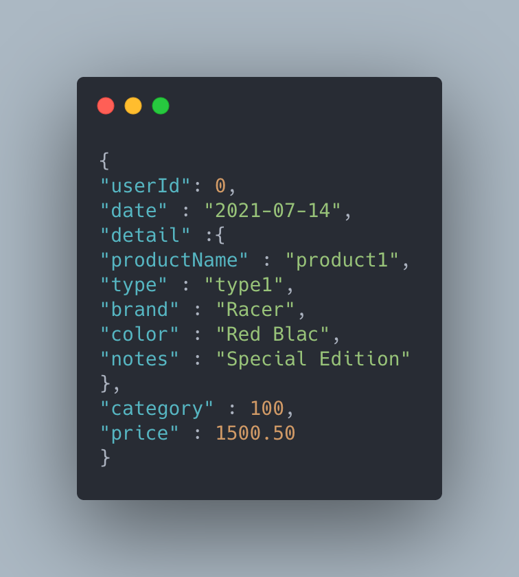
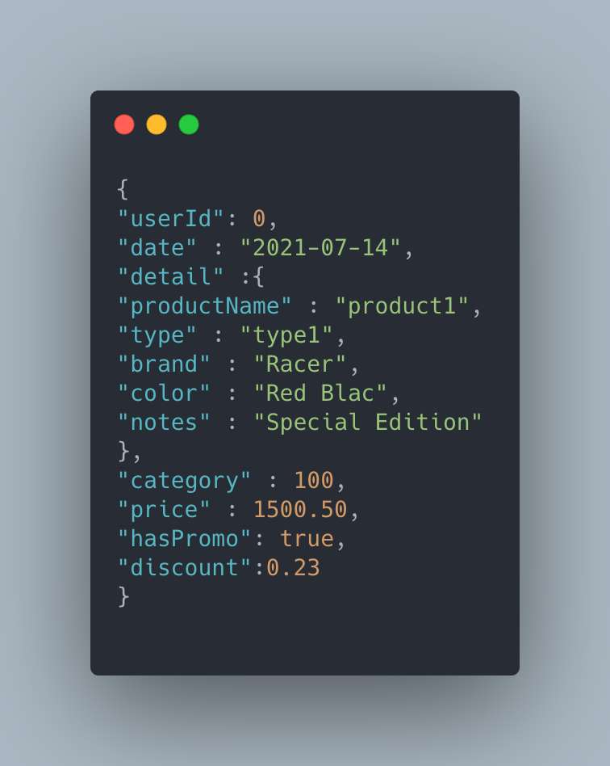

# Spring initial challenge

Api RestFul that implements a series of tools that facilitates buyers and sellers
a totally innovative experience, where the bond that unites them is much more near.

This is known as “SocialMeli”, where buyers will be able to follow your favorite sellers and find out all the news that they post.


## Getting Started

The following instructions will allow you to have a copy of the project and run it on your machine.

### Prerequisites

* [Maven](https://maven.apache.org/) - Dependency Management
* [Java 11](https://www.oracle.com/co/java/technologies/javase-jdk11-downloads.html) -  Development Environment
* [Git](https://git-scm.com/) - Version Control System
* [Spring](https://spring.io/) - Framework for creating web applications in Java

### Installing

1. Clone the repository (The branch name is Angel_Juan)

```
git clone git@github.com:AlanCanoDigitalHouse/DesafioSpringWave9.git
```

2. Compile the projet

```
mvn package
```

3. Executing the program

```
on DesafioSpring folder

mvn exec:java -D "exec.mainClass"="com.mercadolibre.desafio.DesafioApplication"

In your browser: https://localhost:8080

```
## Endpoints:

The endpoints of the API are the following:
- GET request:
    - /users/{userId}/followers/count/: Get the count of the users that follow a user
    - /users/{UserID}/followers/list: Get the followers of a user (order by name_asc or name_desc)
    - /users/{UserID}/followed/list: Get the users that follow a user (order by name_asc or name_desc)
    - /products/followed/{userId}/list: Get the posts made the users followed by a user
    - /products/{userId}/countPromo/: Get the count of the promo post of a user
    - /products/{userId}/list/: Get the promo posts of a user

- POST request:
    - /users/{userId}/follow/{userIdToFollow}: Follow a user given two user id's
    - /users/{userId}/unfollow/{userIdToUnfollow}: Do the unfollow given two users id's
    - /products/newpost: Create a new post
    - /products/newpromopost

Make the requests to localhost:8080

Body Explamples

**Important the format date if yyyy-MM-dd**

### Post body



### Post Promo body




## Built With

* [Maven](https://maven.apache.org/) - Dependency Management
* [Spring](https://spring.io/) - Framework for creating web applications in Java


## Author

* **Juan Camilo Angel Hernandez**


## License

This project is under GNU General Public License - see the [LICENSE](LICENSE) file for details.
