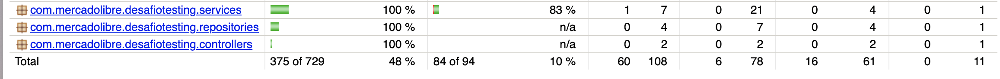

# Spring testing challenge

The objective of this project is to apply validations
and types of testing based on the following requirements document [document](doc.pdf)


## Getting Started

The following instructions will allow you to have a copy of the project and run it on your machine.

### Prerequisites

* [Maven](https://maven.apache.org/) - Dependency Management
* [Java 11](https://www.oracle.com/co/java/technologies/javase-jdk11-downloads.html) -  Development Environment
* [Git](https://git-scm.com/) - Version Control System
* [Spring](https://spring.io/) - Framework for creating web applications in Java

### Installing

1. Clone the repository (The branch name is Angel_Juan)

```
git clone git@github.com:AlanCanoDigitalHouse/DesafioSpringWave9.git
```

2. Compile the projet

```
mvn package
```

3. Executing the program

```
on desafiotesting folder

mvn exec:java -D "exec.mainClass"="com.mercadolibre.desafiotesting"


```

4. Testting the program

```
on desafiotesting folder

mvn test

```


### Coverage




## Built With

* [Maven](https://maven.apache.org/) - Dependency Management
* [Spring](https://spring.io/) - Framework for creating web applications in Java


## Author

* **Juan Camilo Angel Hernandez**


## License

This project is under GNU General Public License - see the [LICENSE](LICENSE) file for details.
